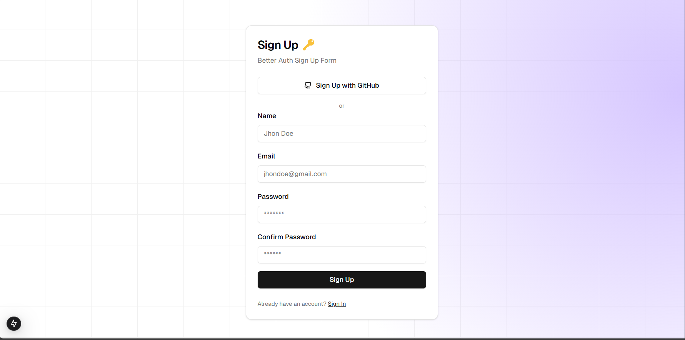
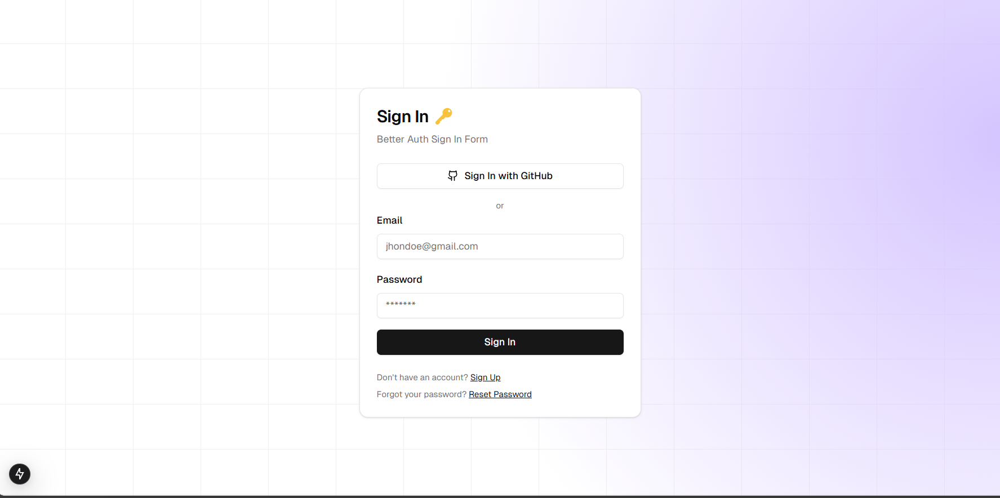
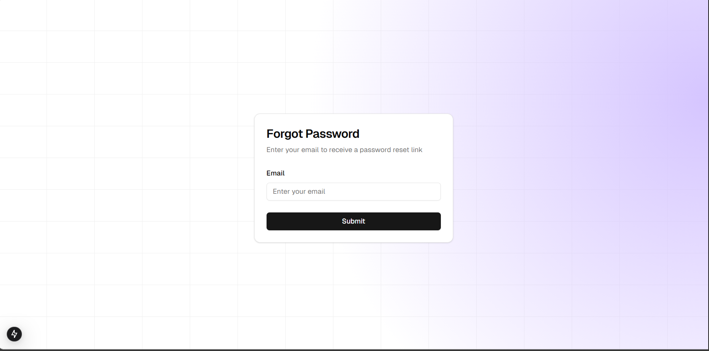
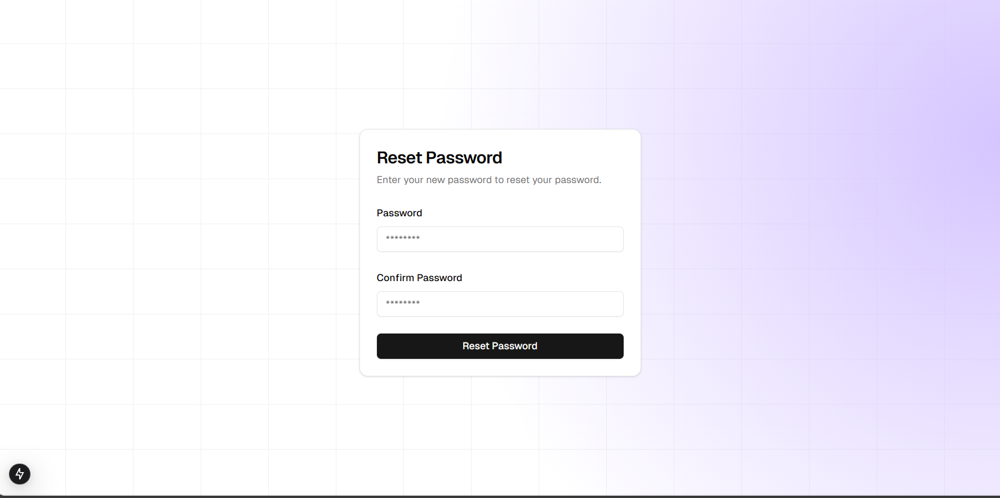
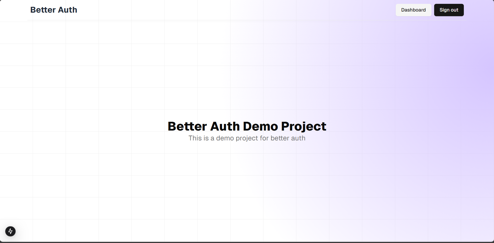
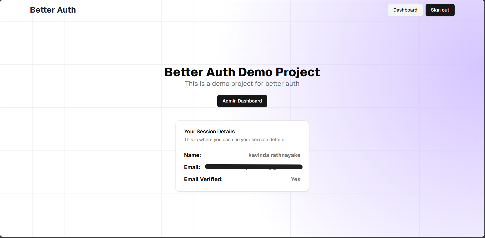
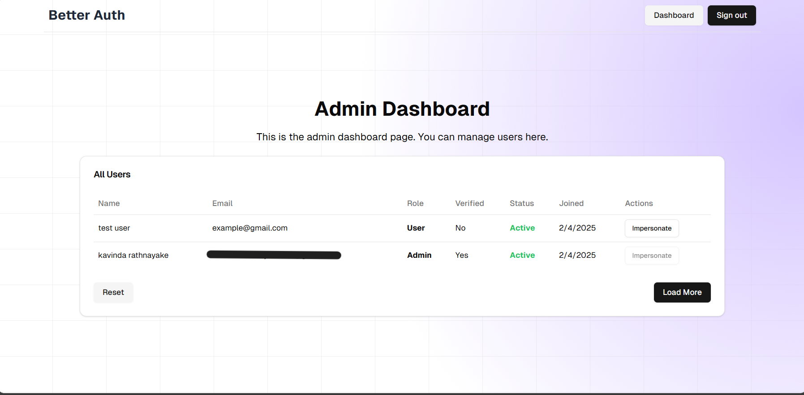

# Better Auth Example

This is a simple example of how to use Better auth with NextAuth.js.

## Technologies Used

- [Next.js](https://nextjs.org)
- [BetterAuth.js](https://better-auth.vercel.app)
- [Prisma](https://prisma.io)
- [Tailwind CSS](https://tailwindcss.com)

## Getting Started

First, clone the repository:

```bash
git clone https://github.com/kavinda-100/Better-Auth-Demo.git
```

Then, install the dependencies:

```bash
cd better-auth 
bun install
```

Create a `.env` file in the root of the project and add the environment variables from the `.env.example` file.


Then, run the migrations:

```bash
bunx prisma generate
bunx prisma db push
```

Finally, run the development server:

```bash
bun run dev
```


## Additional Packages
### Dependencies
```bash
bun add better-auth @better-fetch/fetch nodemailer @react-email/components
```
### preview

- SignUp Page

- SignIn Page

- Forgot Password Page

- Reset Password Page

- Home Page

- Dashboard Page

- Admin Dashboard Page
